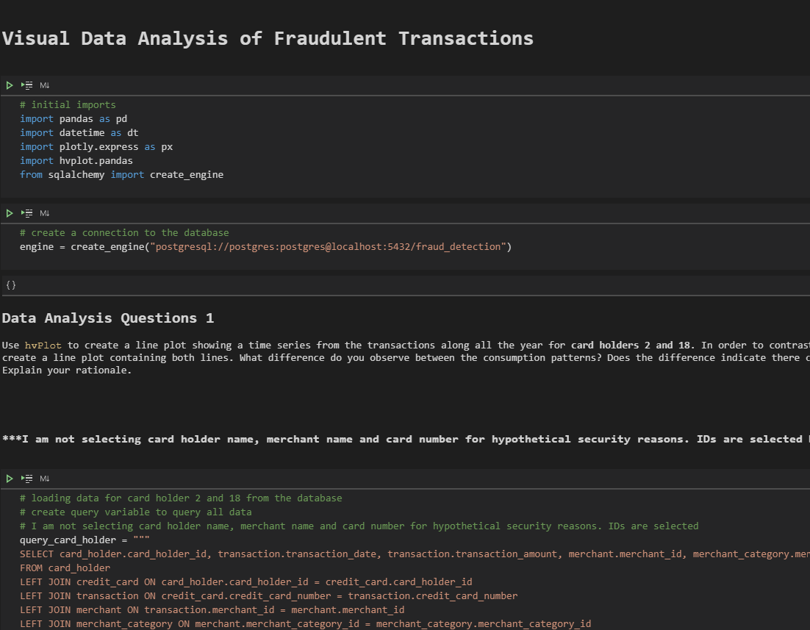
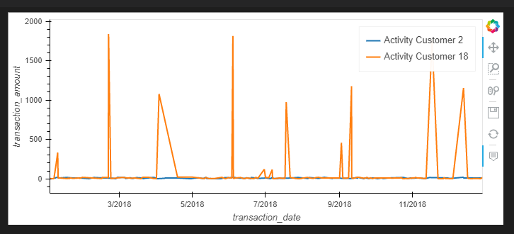

# Project Name
In this assignment I am able to use my new SQL skills learned from the Rice University FinTech Bootcamp to analyze historical credit card transactions and possibly uncover fraudulent activity.[1]

---

## Table of contents
* [General info](#general-info)
* [Screenshots](#screenshots)
* [Technologies](#technologies)
* [Installation Guide](#installation-guide)
* [Code Examples](#code-examples)
* [Usage](#usage)
* [Sources](#sources)
* [Status](#status)
* [Contributors](#contributors)

---

## General Information

### _Fraud is Everywhere!_

Unfortunately, fraud comes in multiple forms and is found in various technology.  This is where I come in to help.  The three main tasks for this project are:

    1. Data Modeling: Define a database model to store the credit card transactions data and create a new PostgreSQL database using your model.

    2. Create a database schema on PostgreSQL and populate your database from the CSV files provided.

    3. Analyze the data to identify possible fraudulent transactions.
    [1]

---

## Screenshots

- 

- 

---

## Technologies

* Python - Version 3.8.5
* VS Code - Version 1.49.1
* Jupyter Notebook - Version 6.1.1
* Windows 10
* pgAdmin4 - Version 4.2
* Library - pandas
* Library - datetime
* Library - plotly.express
* Library - hvplot.pandas
* Library - sqlalchemy

---

## Installation Guide

1. Download the entire suspicious_transactions repository
2. Open Git Terminal
3. Navigate into the repository file path where you stored the files during the download.
4. The files should be visible and ready to run.

*See the [Usage](#usage) section below for instructions on how to run the notebook.

---

## Code Examples

- Section of code to select the data using a sql statement from pgAdmin4.

``` python
query_card_holder = """
SELECT card_holder.card_holder_id, transaction.transaction_date, transaction.transaction_amount, merchant.merchant_id, merchant_category.merchant_category_name
FROM card_holder
LEFT JOIN credit_card ON card_holder.card_holder_id = credit_card.card_holder_id
LEFT JOIN transaction ON credit_card.credit_card_number = transaction.credit_card_number
LEFT JOIN merchant ON transaction.merchant_id = merchant.merchant_id
LEFT JOIN merchant_category ON merchant.merchant_category_id = merchant_category.merchant_category_id
"""

# read in all data as dataframe
df_card_holder = pd.read_sql(query_card_holder, engine)
```

- 

---

## Usage

1. To run the analysis process, navigate to the directory where visual_data_analysis.ipynb is located using Git Terminal within the suspicious transactions directory or where ever you save the repository.
2. Execute the command 'code .' in the terminal to open VS Code.
3. VS Code opens.  Select the visual_data_analysis.ipynb file in the suspicious_transactions directory found in the left side navigation pane or where you saved the repository.
4. Click the Run All Cells button, double arrows, found at the top of the main workspace to run all cells in the Jupyter Notebook file.
5. All cells in the notbook run.  The simulations can take a few minutes to run, so please be patient while they process and display the data on the screen.

---

## Sources

- [1] https://rice.bootcampcontent.com/Rice-Coding-Bootcamp/rice-hou-fin-pt-09-2020-u-c/tree/master/hw/07-SQL/Instructions

- [2] https://www.quickdatabasediagrams.com/

- [3] https://pandas.pydata.org/pandas-docs/stable/reference/api/pandas.DataFrame.between_time.html

- [4] https://docs.python.org/3/library/datetime.html

---

## Status

Project is: _finished_

---

## Contributors

* Jonathan Owens
* LinkedIn: www.linkedin.com/in/jonowens
